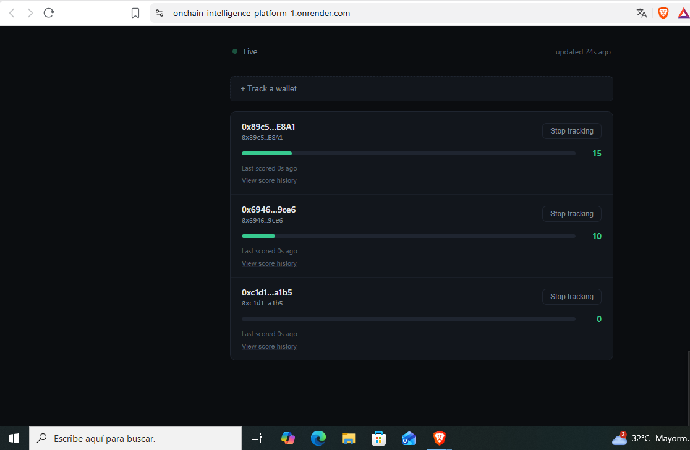

# Wallet Activity Analyzer

An Ethereum wallet behavior profiling microservice that scans bounded block ranges, summarizes historical transfer activity, tracks total ETH moved, and identifies contract interaction ratios using raw RPC endpoints.

# Wallet Activity Analyzer

An Ethereum wallet behavior profiling microservice that scans bounded block ranges, summarizes historical transfer activity, tracks total ETH moved, and identifies contract interaction ratios using raw RPC endpoints.



**Live demo:** _pending deployment_  
**Video walkthrough:** _pending_

## Problem

Querying wallet activity directly from raw RPC nodes across multiple block ranges requires expensive loops and leads to timeout errors on free-tier providers. Without bounded scanning logic and structured aggregations, analyzing recent wallet history requires heavy indexing infrastructure.

## Solution

A Python service powered by Web3.py and FastAPI that:

1. Connects to Ethereum mainnet via Web3.py HTTP Provider
2. Normalizes input addresses using `Web3.to_checksum_address` validation
3. Scans block ranges bounded by `LOOKBACK_BLOCKS` to prevent RPC rate-limit throttling
4. Aggregates activity metrics: transaction counts, total ETH transferred, and smart contract interaction detection
5. Exposes REST endpoints for instant wallet behavior profiling

## Architecture

Client / API Request (/wallet/{address}/activity)│▼FastAPI Service Layer│▼Web3.py Client (app/blockchain.py)│▼Ethereum Mainnet RPC (Infura/Alchemy)│┌────────────────────┴────────────────────┐▼                                         ▼Block Scanning Loop             Transaction Normalization(from_block -> to_block)        (wei -> ether, checksum validation)│                                         │└────────────────────┬────────────────────┘▼Aggregated Metrics Summary JSON(tx_count, total_value_eth, contract_interactions)
- **Backend**: Python, FastAPI, Pydantic v2 (pydantic-settings), Web3.py
- **RPC Provider**: Ethereum Mainnet (Infura / Alchemy / Anvil)

## Stack

Python · FastAPI · Web3.py · Pydantic · Ethereum RPC

## Running locally

```bash
python3 -m venv venv
source venv/bin/activate
pip install -r requirements.txt
cp .env.example .env  # fill in ETHEREUM_RPC_URL
uvicorn app.main:app --reload --port 8003
APIMethodEndpointDescriptionGET/healthService health status and RPC connectivity checkGET/wallet/{address}/activityReturns transaction metrics and contract interaction breakdownTechnical decisionsBounded Lookback Protection: Enforced strict lookback_blocks limits in Settings to prevent infinite loop execution and avoid rate-limiting on free-tier RPC providers.Checksum Normalization: Standardized address inputs via Web3.to_checksum_address to prevent string mismatch bugs during from/to address comparison.Contract Payload Identification: Detected smart contract calls by evaluating transaction payload inputs against empty hex values (0x / b"").Challenges & learningsHandled RPC execution timeouts on heavy block requests by catching block-level fetch exceptions gracefully without breaking the scan loop.Optimized conversion efficiency by handling wei-to-ether transformations directly using w3.from_wei prior to float aggregation.LicenseMITO
